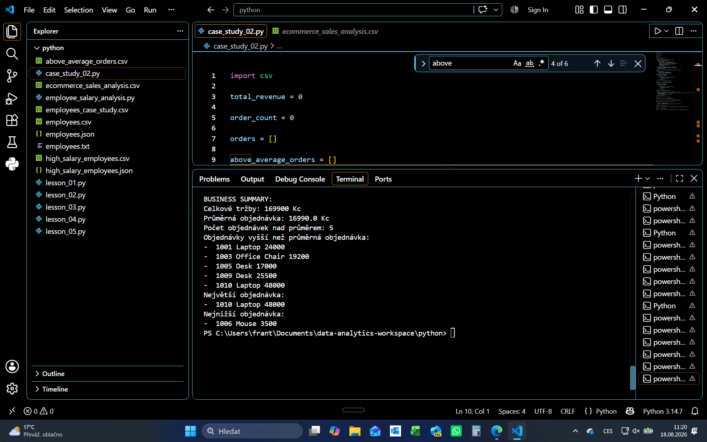

# Case Study 02 - E-commerce Sales Analysis

Malá Python case study zaměřená na analýzu objednávek a tržeb e-commerce společnosti.

Cílem projektu je procvičit práci s daty uloženými v CSV souboru, jejich načtení do Pythonu, převod datových typů, výpočty nad jednotlivými objednávkami, filtrování výsledků a export vybraných dat do nového CSV souboru.

---

## Cíl analýzy

Analýza odpovídá na následující otázky:

- Jaké jsou celkové tržby ze všech objednávek?
- Jaká je průměrná hodnota objednávky?
- Kolik objednávek má hodnotu vyšší než průměr?
- Které objednávky mají hodnotu vyšší než průměr?
- Která objednávka má nejvyšší hodnotu?
- Která objednávka má nejnižší hodnotu?

Součástí projektu je také export objednávek s nadprůměrnou hodnotou do samostatného CSV souboru.

---

## Dataset

Vstupní data jsou uložena v souboru:

`ecommerce_sales_analysis.csv`

Dataset obsahuje informace o jednotlivých objednávkách:

- `order_id` — ID objednávky
- `product` — produkt
- `category` — kategorie produktu
- `quantity` — počet kusů
- `unit_price` — cena za jeden kus
- `customer` — zákazník

Po načtení dat Python dopočítává pro každou objednávku také:

- `total` — celkovou hodnotu objednávky

Výpočet:

```python
row["total"] = row["quantity"] * row["unit_price"]
```

---

## Hlavní výsledky

Analýza ukázala:

- Celkové tržby: **169 900 Kč**
- Průměrná hodnota objednávky: **16 990 Kč**
- Počet objednávek nad průměrem: **5**
- Největší objednávka: **1010 — Laptop — 48 000 Kč**
- Nejnižší objednávka: **1006 — Mouse — 3 500 Kč**

Objednávky s hodnotou vyšší než průměr:

| ID objednávky | Produkt | Hodnota |
| --- | --- | ---: |
| 1001 | Laptop | 24 000 Kč |
| 1003 | Office Chair | 19 200 Kč |
| 1005 | Desk | 17 000 Kč |
| 1009 | Desk | 25 500 Kč |
| 1010 | Laptop | 48 000 Kč |

---

## Postup analýzy

Analýza probíhá v několika základních krocích:

1. Načtení dat z CSV souboru pomocí `csv.DictReader()`.
2. Převod hodnot `quantity` a `unit_price` z textu na čísla.
3. Výpočet celkové hodnoty každé objednávky.
4. Výpočet celkových tržeb.
5. Výpočet průměrné hodnoty objednávky.
6. Výběr objednávek s hodnotou vyšší než průměr.
7. Nalezení největší a nejnižší objednávky.
8. Vytvoření businessového shrnutí.
9. Export nadprůměrných objednávek do nového CSV souboru.

Základní tok analýzy lze shrnout jako:

**CSV data → načtení → úprava datových typů → výpočty → filtrování → businessové shrnutí → export výsledku**

---

## Použité Python koncepty

V projektu jsou použity základní principy Pythonu:

- práce s CSV soubory
- `csv.DictReader()`
- `csv.DictWriter()`
- listy
- dictionaries
- `for` cykly
- podmínky `if`
- vlastní funkce pomocí `def`
- parametry funkcí
- `return`
- `append()`
- `len()`
- `round()`
- převod datových typů pomocí `int()`
- výpočty nad daty
- filtrování dat pomocí podmínek
- zápis výsledků do nového CSV souboru

---

## Businessové shrnutí

Výstup Python skriptu poskytuje stručné shrnutí hlavních výsledků analýzy:

```text
BUSINESS SUMMARY:
Celkové tržby: 169900 Kc
Průměrná objednávka: 16990.0 Kc
Počet objednávek nad průměrem: 5
Objednávky vyšší než průměrná objednávka:
- 1001 Laptop 24000
- 1003 Office Chair 19200
- 1005 Desk 17000
- 1009 Desk 25500
- 1010 Laptop 48000
Největší objednávka:
- 1010 Laptop 48000
Nejnižší objednávka:
- 1006 Mouse 3500
```

### Ukázka výstupu z Pythonu



---

## Výstupní CSV

Objednávky s hodnotou vyšší než průměr jsou automaticky uloženy do samostatného souboru:

`above_average_orders.csv`

Výstupní soubor obsahuje:

- `order_id`
- `product`
- `category`
- `quantity`
- `unit_price`
- `customer`
- `total`

➡️ [Zobrazit výstupní CSV](./above_average_orders.csv)

---

## Zdrojový kód

Celá analýza je vytvořena v Pythonu bez použití externích analytických knihoven.

Data jsou načtena ze vstupního CSV souboru a následně zpracována pomocí základních Python konstrukcí, jako jsou listy, dictionaries, cykly, podmínky a vlastní funkce.

➡️ [Zobrazit Python kód](./ecommerce_sales_analysis.py)

➡️ [Zobrazit vstupní dataset](./ecommerce_sales_analysis.csv)

---

## Co jsem si na projektu procvičil

Na této case study jsem si procvičil práci s daty uloženými mimo samotný Python.

Oproti předchozí case study je důležitým krokem načtení dat z CSV souboru pomocí `csv.DictReader()`. Jednotlivé řádky jsou následně zpracovávány jako dictionaries.

Při načtení CSV bylo také potřeba řešit datové typy. Číselné hodnoty jsou z CSV načteny jako text, proto bylo nutné hodnoty `quantity` a `unit_price` převést pomocí `int()` před provedením výpočtů.

Pro každou objednávku jsem následně dopočítal její celkovou hodnotu:

```python
row["total"] = row["quantity"] * row["unit_price"]
```

Další část analýzy využívá filtrování objednávek podle průměrné hodnoty a vlastní funkce pro nalezení největší a nejnižší objednávky.

Výsledkem není pouze výpis do terminálu. Vybraná data jsou také exportována pomocí `csv.DictWriter()` do nového CSV souboru.

Projekt tak propojuje celý jednoduchý datový proces:

**načtení dat → úprava dat → analýza → filtrování → shrnutí výsledků → export**.
