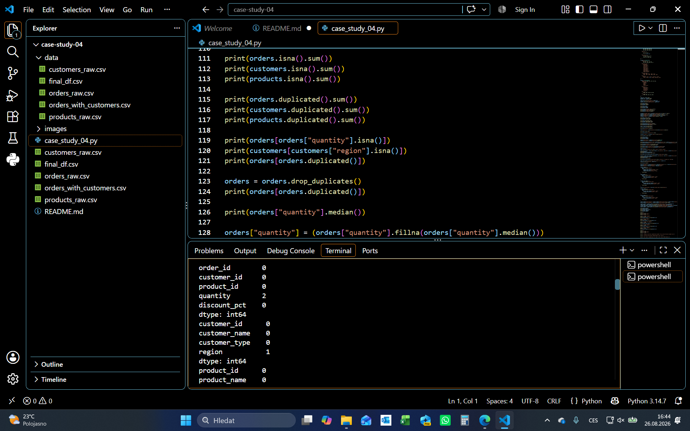
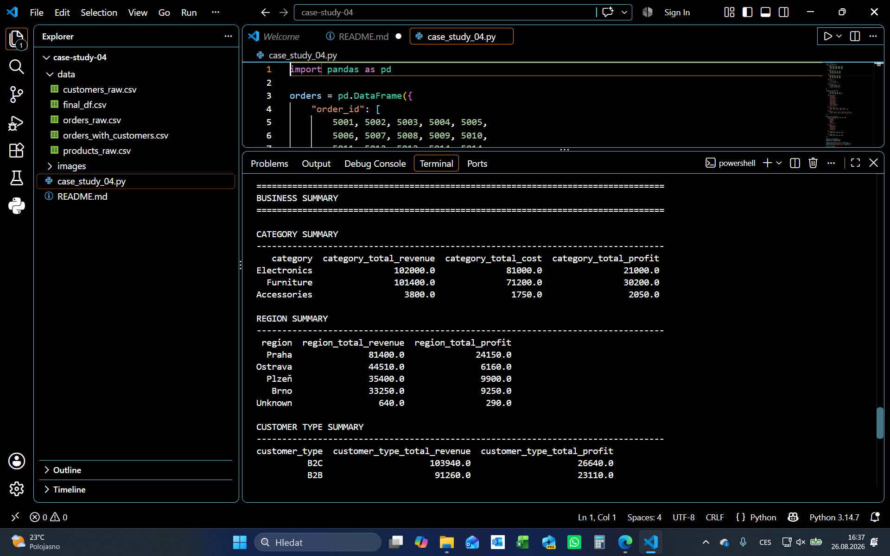
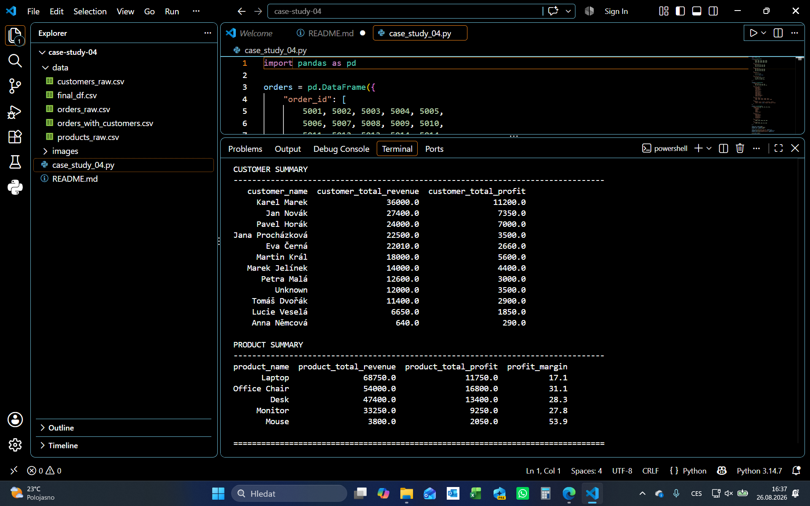
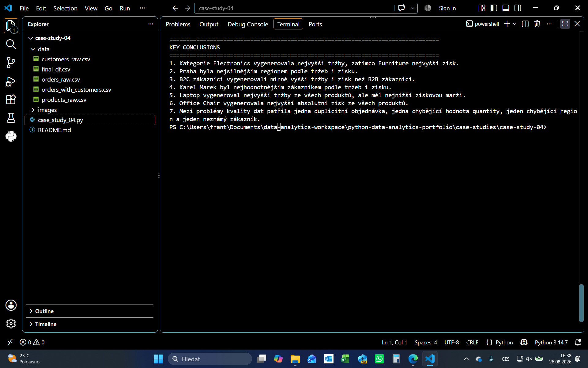

# Case Study 04 — Multi-Table Sales & Customer Analysis

## Přehled

Tato case study se zaměřuje na analýzu prodejních dat uložených ve více tabulkách.

Cílem bylo:

- zkontrolovat a vyčistit vstupní data,
- ověřit kvalitu a konzistenci klíčů,
- propojit tabulky `orders`, `customers` a `products`,
- vytvořit analytické metriky `revenue`, `cost` a `profit`,
- analyzovat výsledky podle kategorií, regionů, typů zákazníků, zákazníků a produktů,
- identifikovat hlavní business závěry.

## Project Structure

```text
case-study-04/
│
├── case_study_04.py
├── README.md
│
├── data/
│   ├── orders_raw.csv
│   ├── customers_raw.csv
│   ├── products_raw.csv
│   ├── orders_with_customers.csv
│   └── final_df.csv
│
└── images/
```

## Soubory

- `case_study_04.py` — kompletní Python workflow
- `orders_raw.csv` — původní objednávky
- `customers_raw.csv` — původní zákazníci
- `products_raw.csv` — původní produkty
- `orders_with_customers.csv` — mezivýsledek po prvním merge
- `final_df.csv` — finální analytický dataset

## Použité technologie

- Python
- pandas

## Struktura dat

Projekt pracuje se třemi hlavními datasety:

```text
orders
customers
products
```

## Workflow

```text
raw data
→ kontrola kvality
→ text cleaning
→ missing values
→ duplicity
→ datové typy
→ business validace
→ kontrola klíčů
→ merge
→ výpočet KPI
→ groupby / agg
→ business závěry
```

## Data Quality & Cleaning

Před samotnou analýzou byla provedena kontrola kvality dat ve všech třech datasetech.

### Zjištěné problémy

- 1 duplicitní objednávka v `orders`
- 1 chybějící hodnota `quantity`
- 1 chybějící hodnota `region`
- 1 objednávka s `customer_id = 999`, který neexistoval v tabulce `customers`

### Provedené úpravy

- textové hodnoty byly standardizovány pomocí `str.strip()`, `str.upper()` a `str.title()`
- duplicitní objednávka byla odstraněna
- chybějící `quantity` byla doplněna mediánem
- chybějící `region` byl označen jako `Unknown`
- datové typy byly upraveny na vhodné číselné typy
- byly ověřeny business podmínky pro `quantity`, `discount_pct`, `unit_price` a `unit_cost`

Objednávka s neznámým zákazníkem byla zachována a označena poznámkou:

```text
Unknown
```

Díky tomu nedošlo ke ztrátě platné obchodní transakce pouze kvůli chybějícím referenčním datům.

## Merge & Analytical Dataset

Po vyčištění dat byly tabulky propojeny pomocí `merge()`.

### Spojení objednávek a zákazníků

Tabulky `orders` a `customers` byly spojeny podle `customer_id`.

Použit byl `left merge`, aby zůstaly zachovány všechny objednávky:

```python
orders_with_customers = orders.merge(
    customers,
    on="customer_id",
    how="left",
    validate="many_to_one"
)
```

Po spojení byl zkontrolován počet řádků a missing values.

Objednávka s `customer_id = 999` zůstala zachována, ale zákaznické údaje byly neznámé.

### Spojení s produkty

Následně byla tabulka `orders_with_customers` spojena s tabulkou `products` podle `product_id`:

```python
final_df = orders_with_customers.merge(
    products,
    on="product_id",
    how="left",
    validate="many_to_one"
)
```

Po druhém merge zůstal počet řádků zachován.

### Finální analytický dataset

Výsledný dataset obsahuje údaje o:

- objednávkách,
- zákaznících,
- produktech,
- cenách,
- nákladech,
- slevách.

Následně byly dopočítány metriky:

```python
final_df["revenue"] = (
    final_df["quantity"]
    * final_df["unit_price"]
    * (1 - final_df["discount_pct"])
)

final_df["cost"] = (
    final_df["quantity"]
    * final_df["unit_cost"]
)

final_df["profit"] = (
    final_df["revenue"]
    - final_df["cost"]
)
```

## Business Analysis & Key Findings

Analýza byla provedena pomocí `groupby()` a pojmenovaných agregací nad kategoriemi, regiony, typy zákazníků, jednotlivými zákazníky a produkty.

### Kategorie

- `Electronics` vygenerovala nejvyšší revenue.
- `Furniture` vygenerovala nejvyšší celkový profit.
- Vyšší revenue tedy automaticky neznamenalo vyšší ziskovost.

### Regiony

- `Praha` byla nejsilnějším regionem podle revenue i profitu.
- `Ostrava` měla vyšší revenue než `Plzeň`, ale nižší profit.

### B2B vs B2C

- `B2C` zákazníci vygenerovali mírně vyšší revenue i profit než `B2B`.

### Zákazníci

- `Karel Marek` byl nejhodnotnějším zákazníkem podle revenue i profitu.
- Objednávka s neznámým zákazníkem byla zachována a označena jako `Unknown`.

### Produkty

- `Laptop` vygeneroval nejvyšší revenue.
- Zároveň měl nejnižší profit margin ze sledovaných produktů.
- `Office Chair` vygenerovala nejvyšší absolutní profit.
- `Mouse` měl nejvyšší profit margin, ale nízké absolutní revenue.

### Hlavní business závěr

```text
vysoké revenue ≠ vysoký profit
vysoký profit ≠ vysoká profit margin
vysoká profit margin ≠ vysoký absolutní profit
```

Proto je při hodnocení výkonnosti vhodné sledovat více metrik současně.

## Screenshots

### Data Quality



### Business Summary — Part 1



### Business Summary — Part 2



### Business Summary — Part 3

