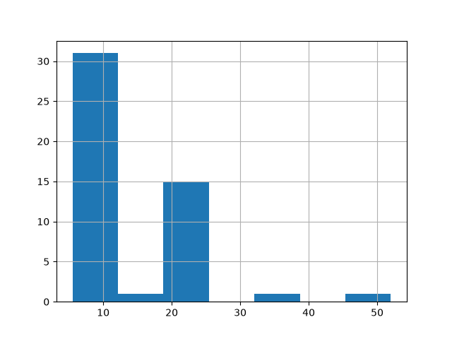
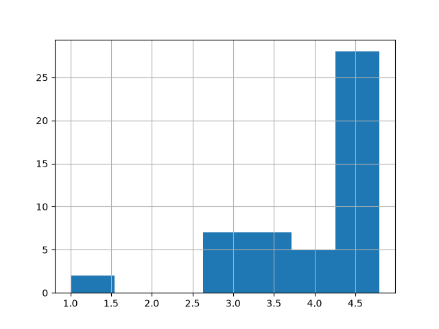
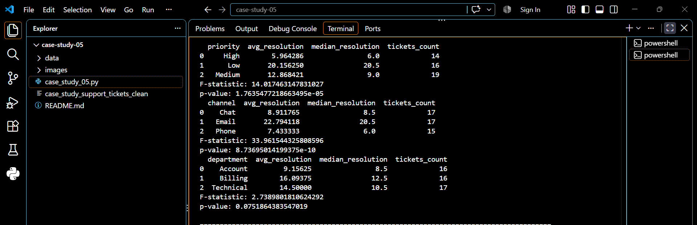
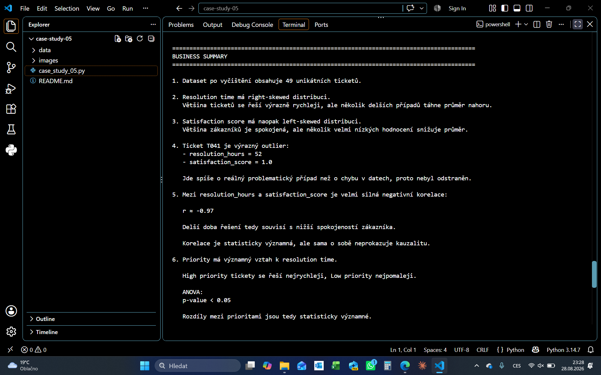
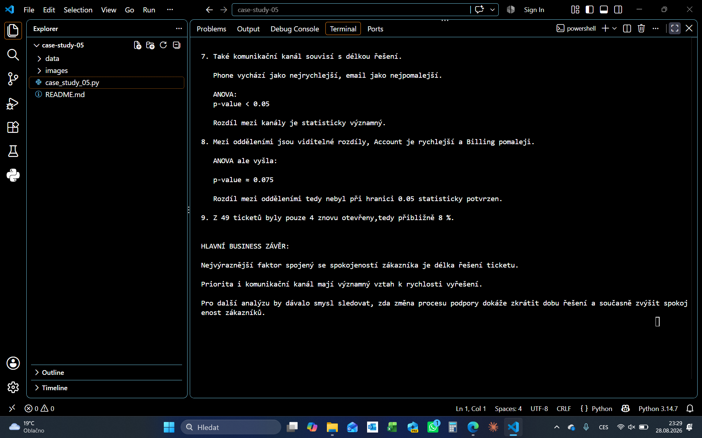

# Case Study 05 — Customer Support Ticket Analysis

## Přehled

Tato case study se zaměřuje na analýzu dat zákaznické podpory.

Cílem bylo:
- zkontrolovat a vyčistit vstupní data,
- analyzovat dobu řešení ticketů a spokojenost zákazníků,
- identifikovat odlehlé hodnoty,
- porovnat výsledky podle priority, komunikačního kanálu a oddělení,
- ověřit vybrané vztahy pomocí základních statistických testů,
- převést výsledky do business závěrů.

---

## Struktura projektu

```text
case-study-05/
│
├── case_study_05.py
├── README.md
│
├── data/
│   ├── case_study_support_tickets.json
│   └── case_study_support_tickets_clean.json
│
└── images/
    ├── business_summary_01.png
    ├── business_summary_02.png
    ├── histogram_resolution_hours.png
    ├── histogram_satisfaction_score.png
    └── priority_channel_department_summary.png
```

---

## Použité technologie

- Python
- pandas
- matplotlib
- scipy
- Git
- GitHub

---

## Workflow

```text
raw JSON data
→ kontrola kvality
→ missing values
→ duplicity
→ text cleaning
→ validace
→ clean dataset
→ EDA
→ outliers
→ groupby / agg
→ korelace
→ ANOVA
→ business závěry
```

---

## Data Quality & Cleaning

Původní dataset obsahoval 50 ticketů.

Byly zjištěny:

- 1 duplicita,
- chybějící hodnoty v `resolved_at`, `agent_name` a `satisfaction_score`,
- nekonzistentní zápis některých kategorií.

Provedené úpravy:

- duplicita byla odstraněna,
- textové hodnoty byly standardizovány,
- chybějící `agent_name` byl označen jako `Unknown`,
- chybějící `satisfaction_score` byl doplněn mediánem,
- `resolved_at` zůstalo prázdné tam, kde mohl ticket stále čekat na vyřešení,
- číselné hodnoty byly validovány.

Po vyčištění zůstalo:

```text
49 unikátních ticketů
```

---

## Exploratory Data Analysis

### Resolution Hours

`resolution_hours` má pravostranně zešikmené rozdělení.

Většina ticketů byla vyřešena relativně rychle, ale několik delších případů zvyšovalo průměr.



### Satisfaction Score

`satisfaction_score` má levostranně zešikmené rozdělení.

Většina hodnocení byla vysoká, ale několik nízkých hodnot snižovalo průměr.



---

## Outlier Analysis

Pomocí IQR metody byl identifikován výrazný ticket:

```text
resolution_hours = 52
satisfaction_score = 1.0
reopened = True
```

Záznam nebyl odstraněn, protože pravděpodobně představuje skutečný problematický případ, nikoliv chybu v datech.

---

## Korelační analýza

Mezi `resolution_hours` a `satisfaction_score` byla zjištěna velmi silná negativní korelace.

```text
Pearson r ≈ -0.966
p-value ≈ 2.77e-29
```

Výsledek ukazuje:

```text
delší doba řešení
→ nižší spokojenost zákazníka
```

Vztah je statisticky významný, ale korelace sama o sobě neprokazuje kauzalitu.

---

## Analýza podle priority

- `High` priority tickety byly řešeny nejrychleji.
- `Low` priority tickety byly řešeny nejpomaleji.

ANOVA:

```text
F-statistic ≈ 14.02
p-value ≈ 0.000018
```

Rozdíly mezi prioritami byly statisticky významné.

---

## Analýza podle komunikačního kanálu

- `Phone` vycházel jako nejrychlejší kanál.
- `Email` jako nejpomalejší.

ANOVA:

```text
F-statistic ≈ 33.96
p-value ≈ 8.74e-10
```

Rozdíly mezi kanály byly statisticky významné.

---

## Analýza podle oddělení

- `Account` působilo jako nejrychlejší oddělení.
- `Billing` jako pomalejší.

ANOVA:

```text
F-statistic ≈ 2.74
p-value ≈ 0.075
```

Rozdíly byly v datech viditelné, ale při hranici `0.05` nebyly statisticky potvrzeny.



---

## Další zjištění

Z 49 ticketů byly znovu otevřeny pouze 4.

```text
reopened rate ≈ 8 %
```

To znamená, že většina ticketů byla uzavřena bez nutnosti opětovného otevření.

---

## Business Analysis & Key Findings

Hlavní závěry:

```text
delší resolution time
→ nižší satisfaction score

High priority
→ rychlejší řešení

Phone
→ nejrychlejší kanál

Email
→ nejpomalejší kanál

Department
→ rozdíly viditelné,
  ale statisticky nepotvrzené
```

Nejdůležitější business metrikou v této analýze je `resolution_hours`, protože velmi silně souvisí se spokojeností zákazníka.

Pro další analýzu by dávalo smysl sledovat, zda změna support procesu dokáže:

```text
zkrátit dobu řešení
→ zvýšit spokojenost
→ snížit počet reopened ticketů
```

---

## Screenshots

### Resolution Hours Distribution


### Satisfaction Score Distribution


### Priority, Channel & Department Analysis


### Business Summary — Part 1



### Business Summary — Part 2


