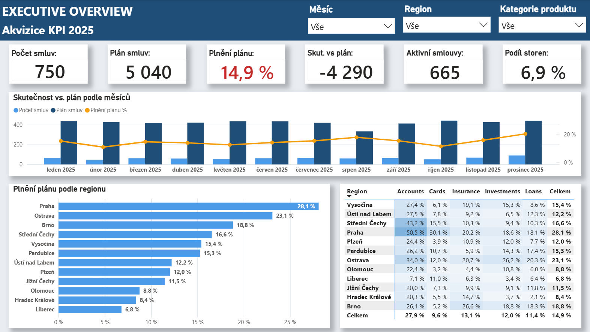

# Case Study 06 — SQL, Python & Power BI Acquisition Analytics

## Přehled

Tato case study simuluje end-to-end analytický workflow nad databázovými daty ve finančním prostředí.

Hlavní cíle:
- vytvořit SQLite databázi,
- načíst a propojit data pomocí SQL,
- převést výsledek do pandas,
- provést cleaning, validaci a outlier analýzu,
- připravit BI-ready datasety,
- načíst je do Power BI,
- vytvořit datový model, DAX KPI a management dashboard.

Z pohledu Python portfolia je hlavní důraz na:
```text
database creation → SQL ingestion → cleaning → validation
→ outlier analysis → business transformations → BI-ready data
```
Power BI zde představuje navazující reportingovou vrstvu.

---

## Business scénář

Dataset simuluje finanční instituci, která sleduje výkon akvizice nových smluv vůči plánu.

Analýza pracuje s informacemi o zákaznících, produktech, smlouvách, regionech, kanálech, produktových kategoriích, stavech smluv, hodnotách smluv a měsíčních akvizičních cílech.

Výsledný reporting sleduje zejména:
- počet smluv,
- plán smluv,
- plnění plánu,
- odchylku od plánu,
- aktivní a stornované smlouvy,
- rozdíly mezi regiony a produktovými kategoriemi,
- strukturu smluv podle akvizičního kanálu a stavu.

---

## Struktura projektu

```text
case-study-06/
├── README.md
├── data/
│   ├── raw/
│   │   ├── case_study_06.db
│   │   ├── case_study_06_contracts_raw.json
│   │   └── case_study_06_targets_raw.json
│   ├── clean/
│   │   ├── case_study_06_contracts_clean.json
│   │   └── case_study_06_targets_clean.json
│   ├── python/
│   │   ├── case_study_06_create_database.py
│   │   └── case_study_06_py_code.py
│   └── power bi/
│       └── case_study_06_dashboard.pbix
└── images/
    ├── case_study_06_pbi_executive_overview.png
    └── case_study_06_pbi_performance_drivers.png
```
## Quick Links

- [Database Creation Script](data/python/case_study_06_create_database.py)
- [Python Cleaning & Validation Script](data/python/case_study_06_py_code.py)
- [SQLite Database](data/raw/case_study_06.db)
- [Raw Contracts](data/raw/case_study_06_contracts_raw.json)
- [Raw Targets](data/raw/case_study_06_targets_raw.json)
- [Clean Contracts](data/clean/case_study_06_contracts_clean.json)
- [Clean Targets](data/clean/case_study_06_targets_clean.json)
- [Power BI Dashboard](data/power%20bi/case_study_06_dashboard.pbix)
- [Executive Overview](images/case_study_06_pbi_executive_overview.png)
- [Performance Drivers](images/case_study_06_pbi_performance_drivers.png)

---

## Použité technologie

Python, pandas, NumPy, SQLite, SQL, Power Query, Power BI, DAX, Git a GitHub.

---

## Workflow

```text
syntetická data → SQLite → SQL SELECT/JOIN → pd.read_sql()
→ data quality checks → cleaning → validation → outlier analysis
→ business transformations → clean datasets → JSON
→ Power Query → Power BI
```

---

## 1. Vytvoření databáze

Databáze `case_study_06.db` vzniká pomocí skriptu:

[case_study_06_create_database.py](data/python/case_study_06_create_database.py)

Obsahuje tabulky:
```text
products
customers
contracts
acquisition_targets
```
Generování používá pevný seed:
```python
random.seed(42)
np.random.seed(42)
```
Díky tomu lze dataset reprodukovat.

V databázi bylo vytvořeno:
- 10 produktů,
- 350 zákazníků,
- 750 základních smluv,
- 5 záměrných duplicit,
- 720 řádků akvizičních cílů.

Po přidání duplicit obsahovala tabulka `contracts` 755 raw řádků.

---

## 2. Zdrojová data

### Products

Hlavní pole:
```text
product_id, product_name, product_category, target_segment
```
Produktové kategorie:
```text
Accounts, Cards, Loans, Investments, Insurance
```

### Customers

Hlavní pole:
```text
customer_id, customer_name, customer_type, region, acquisition_channel
```
Akviziční kanály:
```text
Branch, Online, Partner, Call Center
```

### Contracts

Hlavní pole:
```text
contract_id, customer_id, product_id, contract_date,
contract_status, sales_channel, contract_value
```
Stavy smluv:
```text
Active, Cancelled, Pending
```
`contract_value` se generuje podle konkrétního produktu, aby různé produkty měly realisticky odlišné finanční rozsahy.

### Acquisition Targets

Hlavní pole:
```text
year_month, region, product_category, target_contracts
```
12 měsíců × 12 regionů × 5 kategorií = 720 target rows.

---

## 3. Záměrné problémy v datech

Dataset obsahuje záměrně:
- missing values,
- duplicity,
- nekonzistentní text,
- nadbytečné mezery,
- neplatné `product_id`,
- záporné `contract_value`,
- missing region.

Příklady:
```text
active → místo Active
" Online " → nadbytečné mezery
product_id=999 → neexistující produkt
contract_value=-5000 → businessově neplatná hodnota
```
Cílem bylo vytvořit dataset vhodný pro realistický cleaning workflow.

---

## 4. SQL → Python ingestion

Hlavní analytický skript:

[case_study_06_py_code.py](data/python/case_study_06_py_code.py)

se připojuje přímo k SQLite:
```python
connection = sqlite3.connect("case_study_06.db")
```
SQL propojuje `contracts`, `customers` a `products`.

Použity byly `LEFT JOIN`, aby zůstaly zachovány všechny smlouvy i při neplatné vazbě:
```sql
FROM contracts c
LEFT JOIN customers cu ON c.customer_id = cu.customer_id
LEFT JOIN products p ON c.product_id = p.product_id
```
Výsledek je načten do pandas:
```python
contracts_raw = pd.read_sql(query, connection)
```
Princip:
```text
SQLite → SQL → pandas
```

---

## 5. Raw data a Data Quality Check

Raw dataset zůstává zachovaný:
```python
contracts_raw
```
Pro cleaning vzniká kopie:
```python
contracts_clean = contracts_raw.copy()
```
Kontrola zahrnovala:
```text
head(), shape, info(), isna(), duplicated(), value_counts()
```
Byly kontrolovány datové typy, missing values, duplicity, kategoriální hodnoty, referenční vazby a businessově neplatné hodnoty.

Raw datasety:
- [Contracts Raw](data/raw/case_study_06_contracts_raw.json)
- [Targets Raw](data/raw/case_study_06_targets_raw.json)

---

## 6. Cleaning a validace

### Referential Integrity

Dataset obsahoval smlouvy s `product_id = 999`, který v tabulce `products` neexistuje.

Důležitý princip:
```text
JOIN proběhl úspěšně ≠ všechny klíče jsou validní
```
Smlouva byla zachována a produktové atributy byly označeny jako `Unknown`.

### Text Cleaning

Použito:
```python
.str.strip()
.str.title()
```
Například:
```text
" Online " → Online
active → Active
```
### Duplicity

```python
contracts_clean = (
    contracts_clean
    .drop_duplicates()
    .reset_index(drop=True)
)
```
### Missing Values

```text
missing region → Unknown
missing contract_value → medián
```
Medián byl zvolen kvůli vyšší robustnosti vůči extrémním hodnotám.

### Business Validation

`contract_value <= 0` byla považována za businessově neplatnou.

Kontrolovány byly také:
- min / max datum,
- kategoriální hodnoty,
- numerické rozsahy,
- produktové vazby.

Rozdíl:
```text
technická validace → lze hodnotu zpracovat?
business validace → dává hodnota businessově smysl?
```

---

## 7. Outlier Analysis

Hodnota smlouvy se výrazně liší podle produktu, proto by globální IQR mohl být zavádějící.

Outliery byly analyzovány po jednotlivých produktech:
```text
IQR = Q3 - Q1
Lower = Q1 - 1.5 × IQR
Upper = Q3 + 1.5 × IQR
```
Použity byly `groupby()` a `transform()`:
```python
q1 = contracts_clean.groupby("product_name")[
    "contract_value"
].transform(lambda x: x.quantile(0.25))
```
Důležitý princip:
```text
outlier ≠ automaticky chyba
```
Odlehlé hodnoty proto nebyly automaticky odstraněny.

---

## 8. Business Transformations

### Year Month

```python
contracts_clean["year_month"] = (
    contracts_clean["contract_date"]
    .dt.to_period("M")
    .dt.to_timestamp()
)
```
Tím vznikla společná měsíční granularita pro porovnání smluv s cíli.

### Status Flags

```python
contracts_clean["is_active"] = (
    contracts_clean["contract_status"] == "Active"
)
contracts_clean["is_cancelled"] = (
    contracts_clean["contract_status"] == "Cancelled"
)
contracts_clean["is_pending"] = (
    contracts_clean["contract_status"] == "Pending"
)
```
Tyto flagy zjednodušují následné KPI v Power BI.

---

## 9. Acquisition Targets Validation

Targets byly načteny samostatným SQL dotazem:
```sql
SELECT year_month, region, product_category, target_contracts
FROM acquisition_targets
```
Proběhla kontrola shape, typů, missing values, duplicit, kategorií a základní deskriptivní statistiky.

Targets nevyžadovaly výrazný cleaning, ale byly validovány před použitím v BI modelu.

---

## 10. Clean Datasets a JSON

Po dokončení cleaning a validace vznikly:
- [Clean Contracts](data/clean/case_study_06_contracts_clean.json)
- [Clean Targets](data/clean/case_study_06_targets_clean.json)

JSON byl použit především jako **learning choice**.

Cílem bylo procvičit:
```text
Python → JSON → Power Query → Power BI
```
Nešlo o optimální produkční architekturu.

---

## 11. Power Query a Power BI

Power Query zde sloužil jako lehká přechodová vrstva:
- načtení JSON,
- kontrola struktury,
- kontrola datových typů,
- drobné technické úpravy.

Hlavní cleaning proběhl v Pythonu.

Power BI soubor:

[case_study_06_dashboard.pbix](data/power%20bi/case_study_06_dashboard.pbix)

Report obsahuje dvě stránky:
```text
Executive Overview
Performance Drivers
```
### Executive Overview

Hlavní KPI:
```text
Počet smluv
Plán smluv
Plnění plánu
Odchylka od plánu
Aktivní smlouvy
Podíl storen
```
Další prvky:
- měsíční vývoj skutečnosti vs. plán,
- plnění podle regionu,
- matice region × produktová kategorie,
- synchronizované slicery.



### Performance Drivers

Obsahuje:
- odchylku podle produktové kategorie,
- odchylku podle regionu,
- počet smluv podle akvizičního kanálu a stavu,
- detailní manažerskou tabulku,
- slicery,
- drill-through.


---

## 12. Power BI model a DAX

Model využívá:
```text
contracts_clean
targets_clean
```
a společné dimenze:
```text
DimMonth
DimRegion
DimProductCategory
```
Vybrané DAX KPI:
- Počet smluv,
- Plán smluv,
- Plnění plánu %,
- Odchylka od plánu,
- Počet aktivních smluv,
- Počet stornovaných smluv,
- Podíl stornovaných smluv,
- Počet zákazníků,
- Hodnota aktivních smluv,
- Průměrná hodnota smlouvy.

Příklady:
```DAX
Počet smluv =
DISTINCTCOUNT(case_study_06_contracts_clean[contract_id])
```
```DAX
Plán smluv =
SUM(case_study_06_targets_clean[target_contracts])
```
```DAX
Plnění plánu % =
DIVIDE([Počet smluv]; [Plán smluv])
```
```DAX
Odchylka od plánu =
[Počet smluv] - [Plán smluv]
```

---

## 13. Proč byly technologie použity právě takto

Learning implementace:
```text
SQL → extraction + JOIN
Python → cleaning + validation + preprocessing
Power Query → minimum
DAX → dynamická KPI
Power BI → reporting
```
Cílem bylo procvičit, který nástroj je vhodný pro kterou část workflow.

---

## 14. Profesionálnější produkční postup

Současná learning pipeline:
```text
SQLite → SQL → Python → JSON → Power Query → Power BI
```
Pro pravidelný provoz by bylo vhodnější:
```text
Source Database
→ SQL Extraction / Views
→ Python Cleaning & Validation
→ Clean Database Table
→ Power BI
→ Scheduled Refresh
```
Python by finální data neexportoval do JSON, ale mohl by je zapisovat například do `fact_contracts_clean`.

Výhody:
- méně mezikroků,
- jednodušší refresh,
- lepší automatizace,
- nižší riziko zastaralých souborů,
- lepší auditovatelnost.

---

## 15. Co by mohlo být přesunuto do SQL

V produkčním řešení by jednoduché transformace mohly probíhat už v SQL:
```text
JOIN
TRIM
jednoduché CASE WHEN
základní normalizace
jednoduché filtry
některé NULL kontroly
```
Princip:
```text
jednoduchá relační logika → SQL
```

---

## 16. Role Pythonu v produkčním řešení

Python by zůstal důležitý hlavně pro:
- data quality checks,
- referential integrity,
- komplexnější imputace,
- business validation,
- invalid value checks,
- outlier analysis,
- pokročilejší transformace,
- analytické atributy,
- pipeline validation.

Výsledný princip:
```text
SQL → extraction + simple transformations
Python → robust cleaning + validation
Power Query → minimum
DAX → dynamic metrics
Power BI → reporting
```

---

## 17. Možná automatizace

Při měsíční aktualizaci by pipeline mohla fungovat takto:
```text
1. aktualizace zdrojových dat
2. spuštění SQL extraction
3. spuštění Python cleaning pipeline
4. data quality validation
5. zápis clean dat do databáze
6. refresh Power BI
7. aktualizace dashboardu
```
Python by tak fungoval jako součást opakovatelné datové pipeline.

---

## Klíčové principy

```text
raw data nepřepisovat
JOIN validovat
missing value není automaticky chyba
outlier není automaticky chyba
business validation je stejně důležitá jako technical validation
jednoduchou logiku držet blízko zdroje
Power Query nemusí dělat celý cleaning
DAX používat pro dynamické KPI
Power BI má dostat připravená data
```

---

## Hlavní přínos case study

Projekt ukazuje celý analytický tok:
```text
database → SQL → Python → data quality → validation
→ analytical data → Power BI → management reporting
```
Z pohledu Python portfolia jsou nejdůležitější:
- database creation,
- database ingestion,
- SQL + pandas integration,
- data cleaning,
- missing values,
- duplicates,
- referential integrity,
- business validation,
- outlier detection,
- `groupby()` + `transform()`,
- datetime transformations,
- BI-ready dataset preparation.

---

## Další možné rozšíření

- automatizovaný refresh,
- zápis clean dat zpět do SQL,
- staging a analytical vrstva,
- logging data-quality kontrol,
- historizace stavů smluv,
- cancellation date a reason,
- cíle podle akvizičního kanálu,
- target contract value,
- acquisition costs,
- salesperson / team dimenze.

---

## Shrnutí

Case Study 06 propojuje:
```text
SQLite → SQL → Python → Power BI
```
Learning implementace záměrně využívá JSON jako meziformát, aby bylo možné procvičit další způsob přenosu dat.

V produkčním řešení by bylo vhodnější použít:
```text
Database
→ SQL
→ Python Validation / Preprocessing
→ Clean Database Layer
→ Power BI
```
Taková architektura by byla vhodnější pro pravidelný refresh, automatizaci, auditovatelnost a dlouhodobou údržbu.

Projekt tak ukazuje nejen práci s Pythonem, ale také rozhodování o tom, **který nástroj je vhodný pro jednotlivé části analytického workflow**.